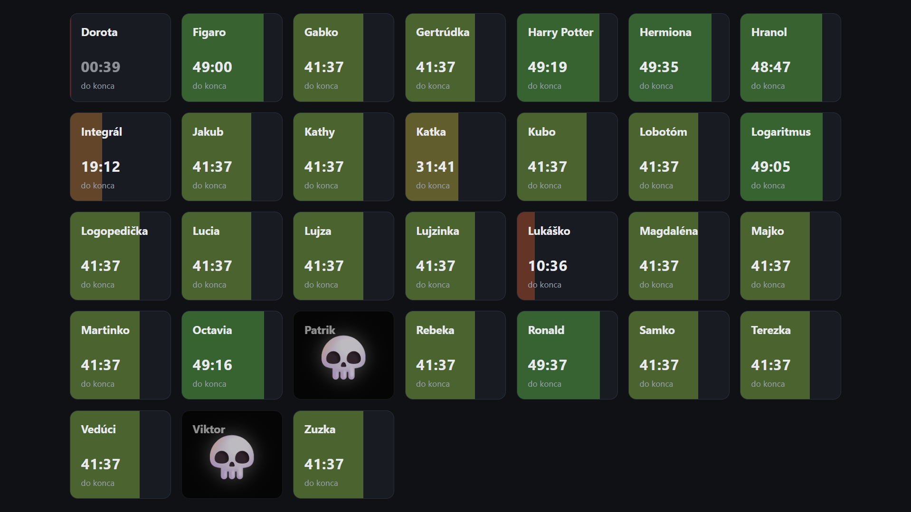

# Apocalypse — hra na sústredenie ☠️



Webová aplikácia pre detské sústredenie: každé dieťa dostane na začiatku odpočet
("čas do zániku") a vedúci mu počas hry nahrávajú dávky vyzbieraných "prísad",
ktoré tento čas predlžujú alebo skracujú. Aplikácia v reálnom čase zobrazuje
živú tabuľu so stavom všetkých účastníkov a poskytuje oddelené panely pre
administrátora a vedúcich.

## Funkcie

- **Live tabuľa** (`/live`) — verejné zobrazenie s odpočtom všetkých účastníkov
  v reálnom čase (cez Socket.IO), prispôsobené tak, aby sa na počítači zmestili
  všetci naraz bez scrollovania; možnosť skryť navigačný panel (Esc ho vráti).
- **Panel vedúceho** (`/leader`) — vyhľadanie účastníka a nahratie dávky prísad,
  ktoré mu zmenia zostávajúci čas (s ochranou proti príliš častému nahrávaniu).
- **Admin panel** (`/admin`) — správa účastníkov a používateľských účtov,
  nastavenie štartovacieho času, oprava/zmazanie chybných nahrávok, manuálne
  nastavenie presného zostávajúceho času a **riadenie hry** (štart / pauza / reset).
- **Riadenie behu hry** — odpočet beží len kým je hra v stave „running“. Pridanie
  prvého účastníka hru samo o sebe nespúšťa — admin ju musí výslovne odštartovať;
  pauza zmrazí čas presne tam, kde sa zastavil, reset (s potvrdením) vráti všetkých
  účastníkov aj históriu nahrávok do počiatočného stavu.

## Technológie

- [Node.js](https://nodejs.org/) + [Express](https://expressjs.com/)
- [Socket.IO](https://socket.io/) — synchronizácia stavu medzi klientmi v reálnom čase
- [express-session](https://github.com/expressjs/session) — prihlasovanie s rolami `admin` / `leader`
- [bcryptjs](https://github.com/dcodeIO/bcrypt.js) — hashovanie hesiel
- Dáta sa ukladajú do jednoduchého JSON súboru (`data/db.json`), bez potreby externej databázy

## Spustenie

Vyžaduje sa Node.js 18+ (testované na Node 22).

```bash
npm install
npm start
```

Server po spustení beží na `http://localhost:3000` (port možno zmeniť cez
premennú prostredia `PORT`):

- Live tabuľa: `http://localhost:3000/live`
- Prihlásenie: `http://localhost:3000/login`

Pri prvom spustení sa automaticky vytvorí predvolený administrátorský účet:

```
používateľské meno: admin
heslo:              admin123
```

Po prihlásení si v admin paneli vytvor ďalšie účty (vedúci aj prípadní ďalší
admini) a prvý admin účet preferenčne preheslúj.

### Konfigurácia

Voliteľné premenné prostredia (pozri vzor v `.env.template` — skopíruj ho ako
`.env` a uprav hodnoty; `.env` sa do gitu necommitne):

| Premenná          | Význam                                                        | Predvolená hodnota               |
|-------------------|----------------------------------------------------------------|----------------------------------|
| `PORT`            | port, na ktorom server počúva                                 | `3000`                           |
| `SESSION_SECRET`  | tajný kľúč pre podpisovanie session cookies                   | vstavaný (zmeň si ho v produkcii)|
| `ADMIN_USERNAME`  | používateľské meno predvoleného admin účtu (vytvorí sa len pri prázdnej databáze používateľov) | `admin`    |
| `ADMIN_PASSWORD`  | heslo predvoleného admin účtu (vytvorí sa len pri prázdnej databáze používateľov) | `admin123` |
| `DB_FILE`         | cesta k JSON súboru s dátami (využíva sa hlavne v testoch)    | `data/db.json`                   |

Pokým si nevytvoríš vlastný `.env`, server použije tieto predvolené hodnoty
(vrátane prihlasovacích údajov admina `admin` / `admin123`) — v produkcii si ich
vždy nastav vlastné.

Zoznam prísad, dĺžku odstupu medzi nahrávkami a predvolený štartovací čas
nájdeš v `config.js`. Skutočný výpočet, ako jednotlivé kombinácie prísad menia
čas účastníka, je zatiaľ len zástupný (`calculate.js`) — každá nahrávka pridá
pevnú 1 minútu, kým sa nedoplní reálna herná logika.

## Testy

```bash
npm test
```

Testy bežia cez vstavaný test runner Node.js (`node --test`) a nezasahujú do
reálnej databázy — počas behu si vytvárajú vlastné dočasné JSON súbory (cez
premennú `DB_FILE`). Pokrývajú:

- výpočet zmeny času z nahrávky prísad (`calculate.js`),
- jadro hernej logiky v `store.js` — virtuálne hodiny hry (štart/pauza/reset,
  zmrazenie odpočtu mimo behu, presný výpočet zostávajúceho času, manuálnu
  úpravu na presnú hodnotu, nahrávanie prísad vrátane odstupu medzi nahrávkami),
- HTTP API a autorizáciu podľa role (`server.js`) — prihlásenie, ochranu
  chránených endpointov, správanie pre rolu `admin` vs. `leader`.

## Štruktúra projektu

```
.
├── server.js          # Express app, REST API, Socket.IO, smerovanie stránok
├── store.js           # databázová vrstva (JSON súbor) a herná logika
├── calculate.js       # výpočet zmeny času na základe vybraných prísad
├── config.js          # zoznam prísad, predvolené hodnoty, tajný kľúč
├── data/db.json       # úložisko dát (negitované, vytvorí sa pri prvom spustení)
├── public/            # statický front-end (HTML, CSS, klientský JS)
│   ├── live.html, admin.html, leader.html, login.html
│   ├── css/style.css
│   └── js/            # common.js, live.js, admin.js, leader.js, login.js
└── test/              # automatizované testy (node:test)
```

## Licencia

Projekt je dostupný pod licenciou [MIT](LICENSE).
